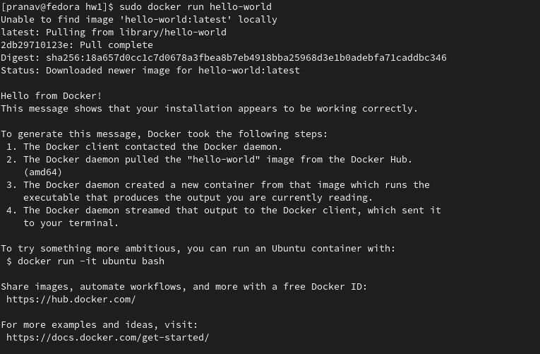

# Docker Installation Steps in Linux (Fedora Linux)- 
1. Check if the docker installed already - 
```
$ docker --version
```
2. If above command doesn't provide information about the docker version installed, we need to install docker. 
3. Now, to install docker engine on your machine, first upgrade your system using following command - 
```
$ sudo dnf upgrade
```
4. After finishing above step, we can start installation of docker. Now, first we need to setup a docker repository using following commands - 
```
$ sudo dnf -y install dnf-plugins-core

$ sudo dnf config-manager \
    --add-repo \
    https://download.docker.com/linux/fedora/docker-ce.repo
```
5. Now, install the docker engine, containerd, and docker-compose - 
```
$ sudo dnf install docker-ce docker-ce-cli containerd.io docker-compose-plugin
```
6. The above command installs the components required for docker and creates a group called `docker`. Now, to start the docker use following command - 
```
$ sudo systemctl start docker
```
7. To verify if docker started properly - 
```
$ sudo systemctl status docker
```
8. To verify installation is proper - 
```
$ sudo docker run hello-world
```
Here's the screenshot of hello-world run in my machine - 


9. Now, if one wants to avoid using sudo before docker commands, we can eliminate it by adding an user to docker group - 
```
$ sudo usermod -aG docker $USER
```
10. Logout or sometimes even reboot the system to make above change effective and verify using - 
```
$ docker run hello-world
```
11. Configure docker to start on OS boot - 
```
$ sudo systemctl enable docker.service

$ sudo systemctl enable containerd.service
```
